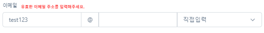
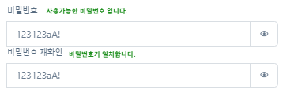

<h2>🚩주문/발주 관리 프로그램🚩</h2>

<h2>프로젝트 소개</h2>

<h2>📚 STACK</h2>

<h3>📕 Environment</h3>

  
  

<h3>📗 Development</h3>

  
  
   
   
   
  
  
  
  
  
  

<h3>📘 Cloud Service</h3>

  

<h2>🔥 프로젝트 내 역할🔥</h2>

**🐹팀원 곽승현** : 공통CSS 관리 & 메인 화면 및 사원 CRUD

<h2>💻 화면 구성</h2>

**[메인화면]**

__[사원 등록]__

__[유효성 검사 문구]__

__[사원 리스트]__

__[사원 수정]__

<h2>💡 주요 기능 상세</h2>

<h2>❗ 프로젝트 회고</h2>

### ✨ Keep

### 💔 Problem

<h2></h2>

