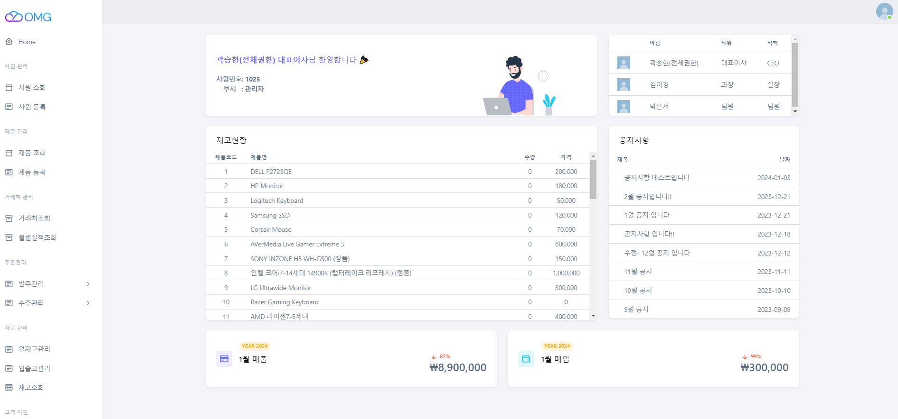
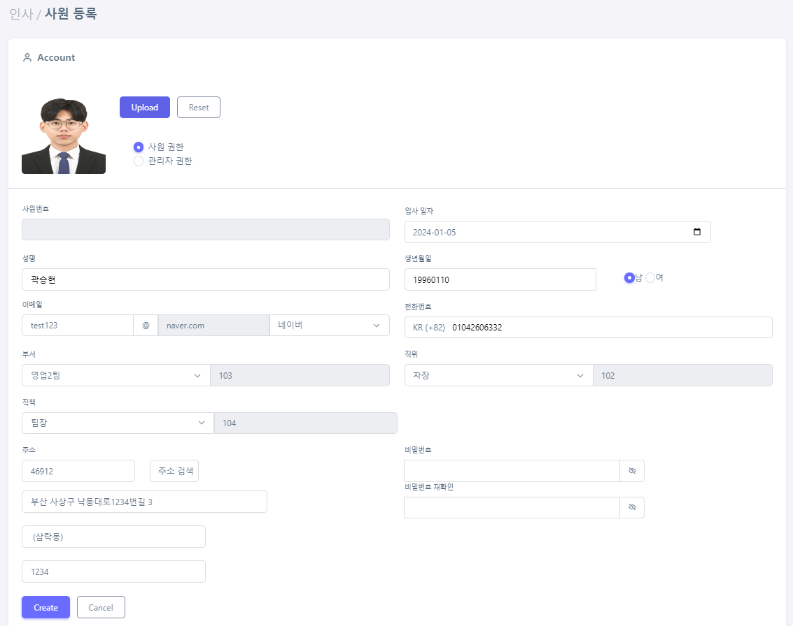
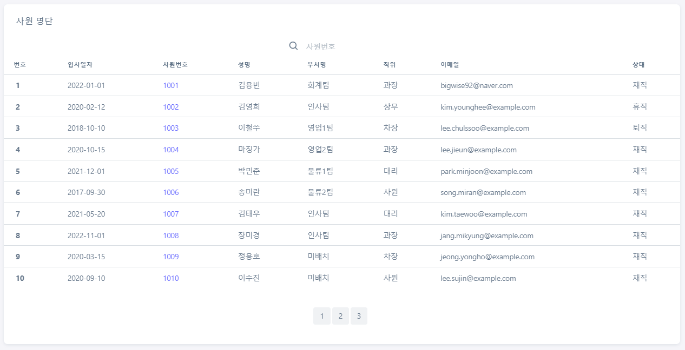
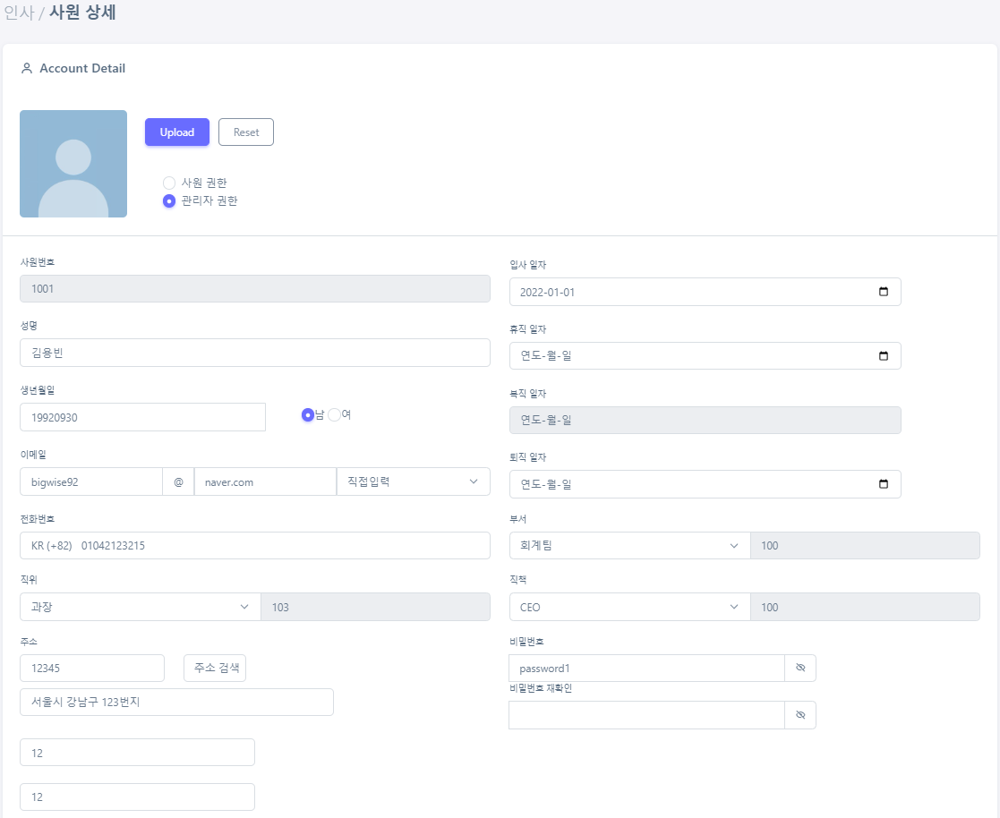

<h2>🚩주문/발주 관리 프로그램🚩</h2>

### 💡PPT
[곽승현_OMG_MEMBER.pdf](https://github.com/gom2gomin/dadok/files/13901680/_OMG_MEMBER.pdf)

### 💡소개

+ 수작업 및 분산된 시스템으로 주문/재고 프로세스를 수행하고 있는 소기업의 업무 정확성과 효율성 저하

+ 주문에 따른 입/출고 재고를 체계적으로 관리하기 위한 비즈니스 플랫폼 개발

### 📌총 프로젝트 작업기간

+ 2023.12.01(금)~2024.01.03(금) [총 4주]

<h2>📚 STACK</h2>

<h3>📕 Environment</h3>

  
  

<h3>📗 Development</h3>

  
  
   
   
   
  
  
  
  
  
  

<h3>📘 Cloud Service</h3>

  

<h2>🔥 역할🔥</h2>
  
**🐹팀원 곽승현** : 공통 CSS 관리 & 메인 화면 및 사원 CRUD

<h2>💻 화면 구성</h2>
  
__[메인화면]__

__[사원 등록]__

__[사원 목록]__

__[사원 상세]__

<h2>💡 구현 기능</h2>

#### Ajax를 활용

+ warehouse, item, price를 **outer join**하여 중복코드의 갯수를 합하여 각 품목의 재고와 가격을 리스트로 구하는 쿼리 작성
+ List를 controller에서 **mapper**에 담은 후 view단에 전송
+ 해당 월의 매입/매출 합계를 구하고 **전월 대비 증감률**을 구하는 기능 구현

#### Java Script & jQuery의 기능을 활용

+ **이벤트 핸들러** 기능을 적극 활용하여 각 컬럼의 불필요한 문자를 사용할 경우 ''로 replace하는 기능 구현
+ \<select\>태그 내의 옵션 값을 옆 \<input\>태그의 출력하는 함수 구현
+ 카카오 **주소 API** 기능 사용
+ 이메일 주소 및 비밀번호 조건 불충족 시 안내 메시지 출력하는 기능 구현
+ 등록 시, **유효성 검사**하여 이상 없을 경우에 등록이 가능하도록 기능 구현   

####  jstl 기능 활용

+ List타입으로 넘어온 변수를 이용하여 table 생성
+ 사원 부서와의 값이 동일 시, 해당 내용 출력
+ 년월일시분초 값을 가진 Date타입의 변수를 받아와 년월일 format으로 변형

<h2>❗ 프로젝트 회고</h2>
  
### ✨ 문제 발생

1. 멤버 등록시 form의 값과 file 타입의 값을 각각 formData에 넣어 ajax로 처리하려는데 오류 발생
    - 불필요한 작업이라 java Script로 처리 (작업 처리는 간단하고 빠르게)

2. Data 타입인 입사일자 String으로 처리
    - jstl을 사용하여 format 처리

### ✨ 아쉬운 점

1. 완성도
짧은 개발 기간을 감안하여 기본CRUD를 바탕으로 프로젝트를 시작하였습니다.
하지만 ERP의 다양한 기능들이 구현되지 않아 완성도에 대해 아쉬움 느낍니다.

2. DB Table 
데이터 베이스 테이블을 설계할 때, Data 타입을 정확히 설정하지 못하여 view단에 값을 받아와 다시 설정을 하는 불필요한 과정을 거쳐야 했습니다.
또한 정규화가 제대로 되어있지 않다고 느껴졌습니다.

3. 기능
ajax를 많이 사용해보려하여 굳지 사용하지 않아도 되는 부분에 사용하려다 많지 않은 시간 속에서도 시간을 소모하였습니다.

### ✨ 느낀 점

다양한 기능을 사용하고 싶어 컬럼의 타입과 기능을 다양한 방식으로 결정하고 처리하려하였습니다.
하지만 그렇게 될 수록 처리하야 하는 불필요한 코드만 많아졌을 뿐입니다.
어렵고 다양한 기능을 넣는 것만이 실력을 증명하는 것이 아니라, 
해당 기능에 적재적소의 기능 결정하는 눈을 가지는 것 또한 실력을 증명하는 것임을 느꼈습니다.

<h2></h2>

